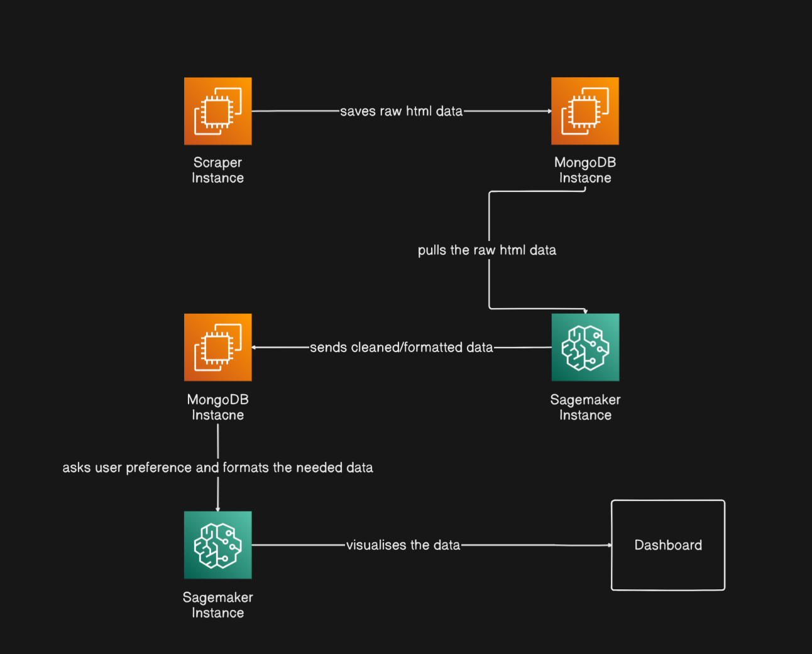

# 🛠️ Raw HTML Data to Cleaned & Formatted Data Pipeline

## **Overview**

A scalable, modular, end-to-end pipeline for **extracting raw HTML data from any website**, processing and transforming it into structured data, and visualizing results—all orchestrated on AWS (EC2, SageMaker), with MongoDB as the backbone for data storage.

---

## **Architecture**

**Flow:**
Dashboard/API → Scraper (autoscaling containers on EC2/Kubernetes) → MongoDB 1 (raw HTML) → SageMaker 1 (data extraction/cleaning) → MongoDB 2 (structured data) → SageMaker 2 (analysis, visualization) → Dashboard



---

## **Component Breakdown & Features**

### 1. **Scraper Instance**

* **Receives list of URLs** (API, JSON, CSV)
* **Spawns new container per page/URL** (autoscaling: Kubernetes/ECS/EC2 ASG)
* **Master container automatically launches worker containers** for each page using Docker or Kubernetes
* **Scrapes raw HTML** for each target URL
* **Runs on AWS EC2 Free Tier** (lightweight)
* **Saves raw HTML to MongoDB Instance 1**
* **API endpoint** for Dashboard to trigger jobs

### 2. **MongoDB Instance 1**

* **Stores ONLY raw HTML** from Scraper
* **>30GB storage provisioned**
* **Optional admin via MongoDB Compass**
* **Exposes data for SageMaker Instance 1**

### 3. **SageMaker Instance 1**

* **Pulls raw HTML** from MongoDB 1
* **Extracts structured data** (product specs, images, URLs, reviews, prices, etc.)
* **Sends cleaned/formatted data to MongoDB 2**
* **Scalable/Containerized as needed**

### 4. **MongoDB Instance 2**

* **Stores processed/cleaned data** from SageMaker 1
* **Acts as a buffer only—no processing**
* **Exposes data for SageMaker 2**

### 5. **SageMaker Instance 2**

* **Pulls processed data** from MongoDB 2
* **Handles user preferences/filters** (from Dashboard)
* **Performs custom analysis, aggregation**
* **Returns visualization/data to Dashboard**

### 6. **Dashboard (Frontend)**

* **UI to input URLs** (single, batch, JSON, CSV)
* **Triggers Scraper API**
* **Visualizes analysis from SageMaker 2**
* **Lets user request custom analysis/filtering**

---

## **Features Checklist**

| Component       | Features Needed                                                  | Status |
| --------------- | ---------------------------------------------------------------- | ------ |
| **Scraper**     | Autoscale, API, scrape any URL, send raw HTML to MongoDB 1       | ✅ Advanced |
| **MongoDB 1**   | Store raw HTML, >30GB, expose data to SageMaker 1                | ✅       |
| **SageMaker 1** | Extract structured data, send to MongoDB 2                       | ✅       |
| **MongoDB 2**   | Store processed data, buffer only, expose to SageMaker 2         | ✅       |
| **SageMaker 2** | Data analysis, user preference, visualization, API for dashboard | ✅ Advanced |
| **Dashboard**   | Input URLs, trigger scrape, visualize results, request analysis  | ✅ Advanced |

> **Note:** Update the table as you implement each part!

---

## **Implementation Roadmap**

1. **Scraper & MongoDB 1**:
   Build/test pipeline for scraping and raw storage.

2. **SageMaker 1**:
   Write extraction/parsing scripts and push to MongoDB 2.

3. **MongoDB 2**:
   Set up as a simple, robust buffer.

4. **SageMaker 2**:
   Add analysis, user query logic, and visualization output.

5. **Dashboard**:
   Start with simple input/trigger UI, add visualizations last.

6. **Integrate all components, test end-to-end, then optimize for scaling, error handling, and cost.**

---

## **Security, Monitoring, and Cost**

* Use VPC/firewalls and secure credential storage for all components.
* Enable logging (CloudWatch, ELK, etc.) in all stages.
* Monitor for rate limits/bans, automate retries, and watch AWS/MongoDB usage to avoid unexpected costs.

---

## **Project Directory Structure**

```
project/
│
├── scraper/               # Scraper app (API, autoscaling, Docker)
├── sagemaker/             # Data extraction, cleaning, analytics
├── dashboard/             # Web app/UI for user input & visualization
├── mongodb/               # MongoDB setup, admin scripts
├── docs/                  # Architecture diagrams, developer docs
├── requirements.txt
├── README.md
└── ...
```

---

## **Contributing**

Open an issue or PR for features, fixes, or ideas!

---

**Contact:**
For questions, raise a GitHub issue or email the maintainer.

---

