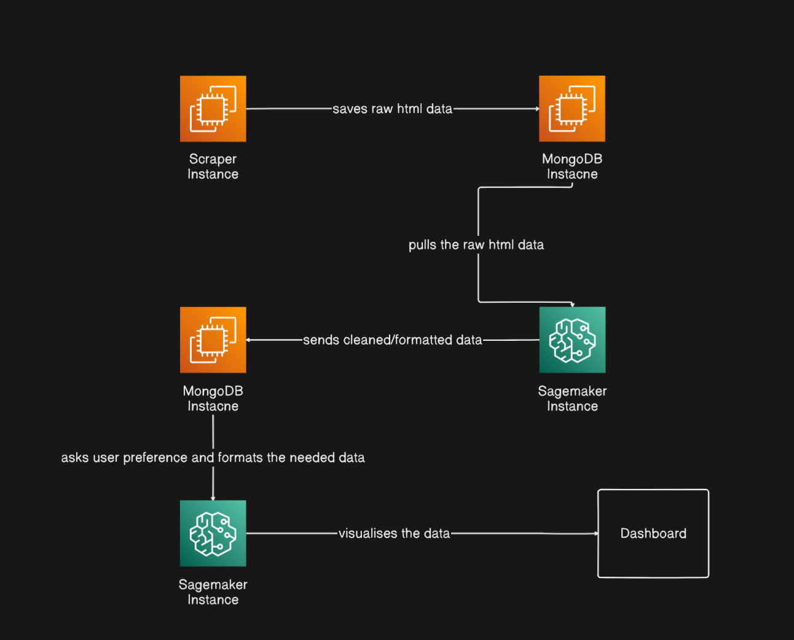

# 🛠️ Raw HTML Data to Cleaned & Formatted Data Pipeline

## Overview

This project is designed to build an end-to-end pipeline for extracting raw HTML data from e-commerce websites, storing it, cleaning and formatting it, and ultimately visualizing it on a dashboard. The architecture leverages AWS EC2 instances, MongoDB for storage, and AWS SageMaker for data processing and visualization.

---

## 📊 Architecture



*Image: High-level architecture showing the flow from Scraper Instance to Dashboard via MongoDB and SageMaker.*

---

## ✅ What’s Completed

- **Architecture Designed:**  
  Clear visual and logical flow established for the data pipeline, from scraping to dashboard visualization (see image above).

- **Scraper Instance (EC2):**
  - Develops and deploys a scraper capable of extracting raw HTML from target URLs.
  - Saves scraped raw HTML directly to a MongoDB instance.

- **MongoDB Instance:**
  - Set up for storing the scraped raw HTML data.
  - Configured to be accessible by the SageMaker processing instance.

---

## 🔜 Tasks To Be Completed

1. **SageMaker Data Processing:**
   - Build the SageMaker pipeline to:
     - Pull raw HTML data from MongoDB.
     - Clean, parse, and format the data as required for downstream use.
     - Send cleaned/formatted data back to MongoDB for storage.

2. **User Preference Handling:**
   - Implement a module to allow user queries/preferences.
   - Format and filter the cleaned data based on user input before visualization.

3. **Data Visualization (Dashboard):**
   - Develop a dashboard (web app or visualization tool) to display processed data.
   - Integrate SageMaker’s output and visualize key metrics and trends.

4. **Automation and Scaling:**
   - Automate the end-to-end flow (triggering scraper, SageMaker processing, and dashboard refresh).
   - Implement scaling strategies (e.g., 1 page = 1 scraper container; consider container orchestration for high-volume scraping).

5. **Logging & Monitoring:**
   - Add detailed logging in all components (Scraper, SageMaker, Dashboard).
   - Implement error handling, rate limiting, and monitoring to avoid bans and ensure reliability.

---

## 🏗️ Next Steps

- Finalize and test the SageMaker cleaning/formatting pipeline.
- Build the dashboard UI and integrate with SageMaker.
- Optimize pipeline for scalability and robustness.
- Enhance documentation and provide deployment scripts.

---

## 💬 How to Contribute

If you’d like to help or have ideas, please open an issue or pull request!

---

## 📁 Project Structure (Planned)

```

project/
│
├── scraper/               # Scraper app code
├── sagemaker/             # Data cleaning & formatting code
├── dashboard/             # Visualization/dashboard code
├── mongodb/               # Setup scripts for MongoDB
├── docs/                  # Documentation and diagrams
├── requirements.txt
├── README.md
└── ...

```

---

**Contact:**  
For queries or collaboration, feel free to open an issue or contact the maintainer.


